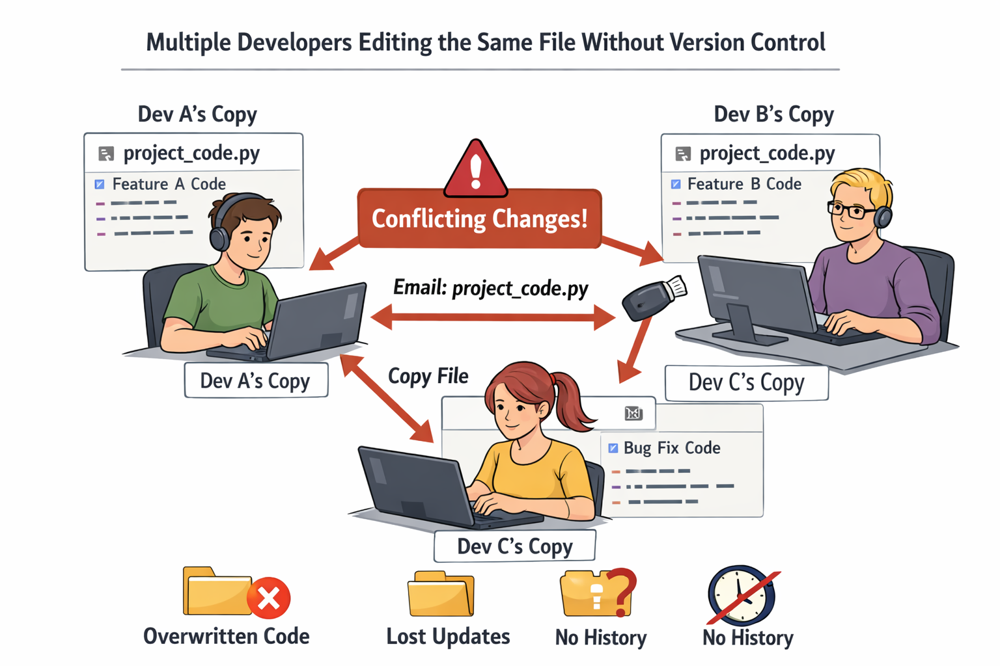
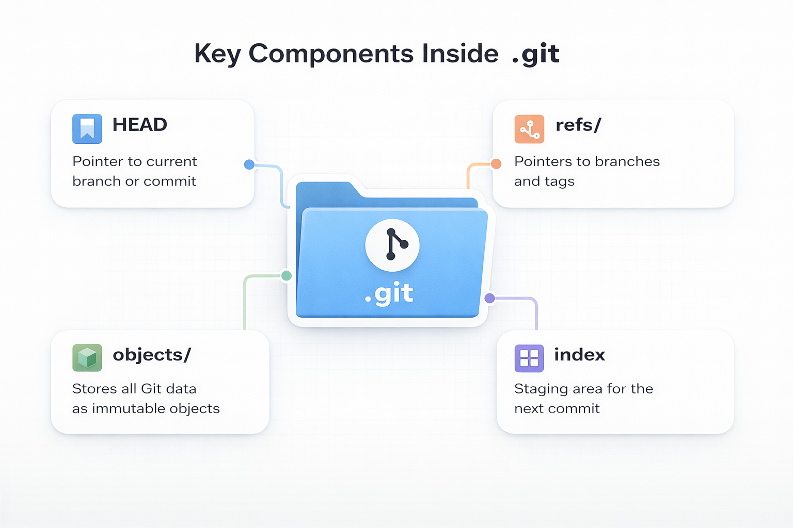
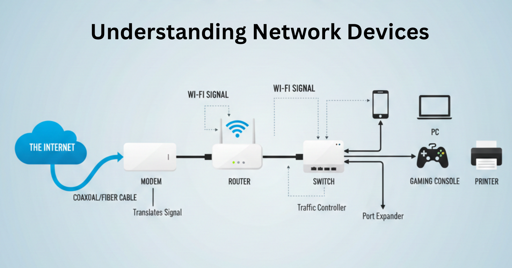
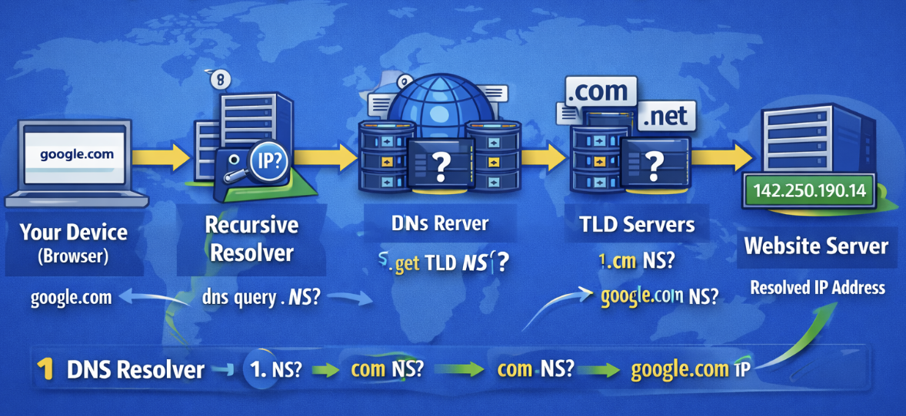
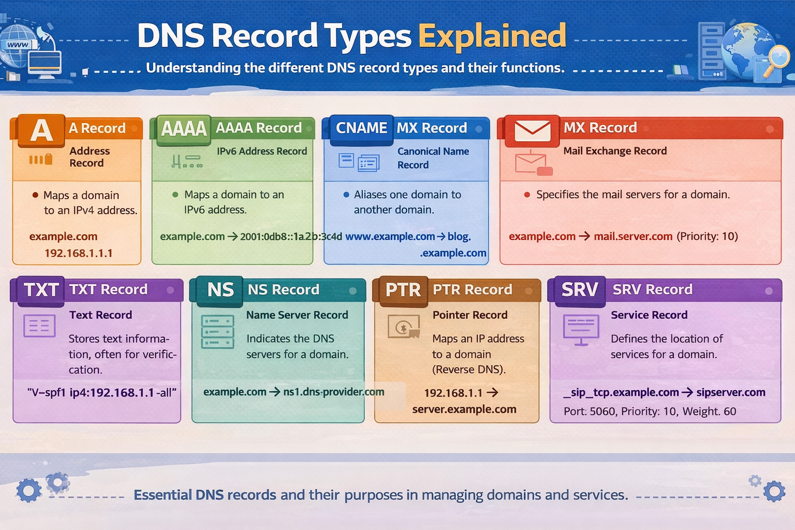
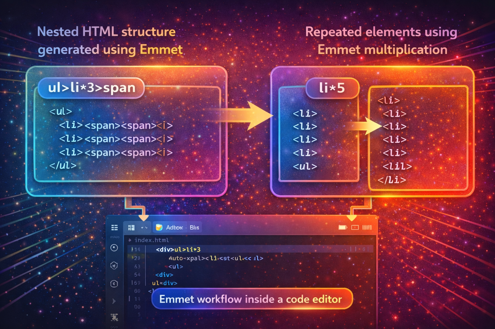

# 📝 Blogs & Technical Articles

Welcome to my knowledge hub 🚀  
Here I write about **Git, Networking, Web, and Developer Fundamentals** — explained in a simple, beginner-friendly way.

---

## 📚 Featured Blog Posts

<table>
<tr>
<td align="center">

### Git for Beginners  

</td>
<td align="center">

### Why Version Control Exists  

</td>
</tr>

<tr>
<td align="center">

### Inside Git  

</td>
<td align="center">

### Understanding Network Devices  

</td>
</tr>

<tr>
<td align="center">

### How DNS Resolution Works  

</td>
<td align="center">

### DNS Record Types Explained  

</td>
</tr>

<tr>
<td align="center">

### Getting Started with cURL  

</td>
<td align="center">

### TCP vs UDP  

</td>
</tr>

<tr>
<td align="center">

### How a Browser Works  

</td>
<td align="center">

### Understanding HTML Tags & Elements  

</td>
</tr>

<tr>
<td align="center">

### Emmet for HTML  

</td>
<td align="center">

### CSS Selectors 101  

</td>
</tr>
</table>

---

## 🌐 Read More Articles

➡️ **Hashnode Blog:**  
🔗 https://blogwithsuraj.hashnode.dev

---

## 💬 Let’s Connect

---

⭐ If you enjoy these blogs, consider starring the repo!