<a href="https://blogwithsuraj.hashnode.dev/">
  <h1 align="center">Blogs Archive</h1>
</a>

  Showcase of my journey to building a solid Foundation.

&nbsp;&nbsp;

 

### [Git for Beginners](https://blogwithsuraj.hashnode.dev/git-for-beginners)

  <a href="https://blogwithsuraj.hashnode.dev/git-for-beginners">
      

      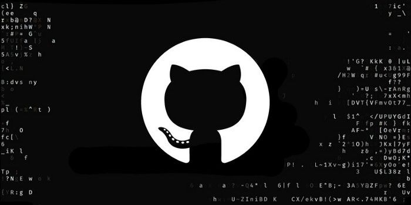
    

  </a>

 

### [Why Version Control Exists](https://blogwithsuraj.hashnode.dev/why-version-control-exists)

  <a href="https://blogwithsuraj.hashnode.dev/why-version-control-exists">
      

      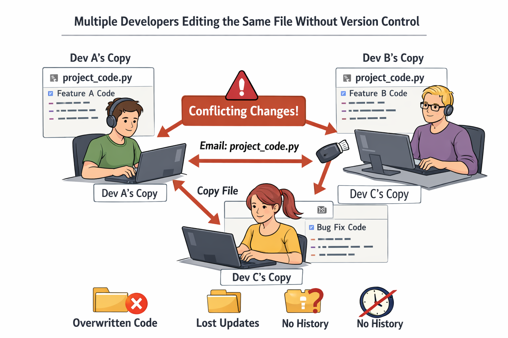
    

  </a>

 

### [Inside Git](https://blogwithsuraj.hashnode.dev/inside-git)

  <a href="https://blogwithsuraj.hashnode.dev/inside-git">
      

      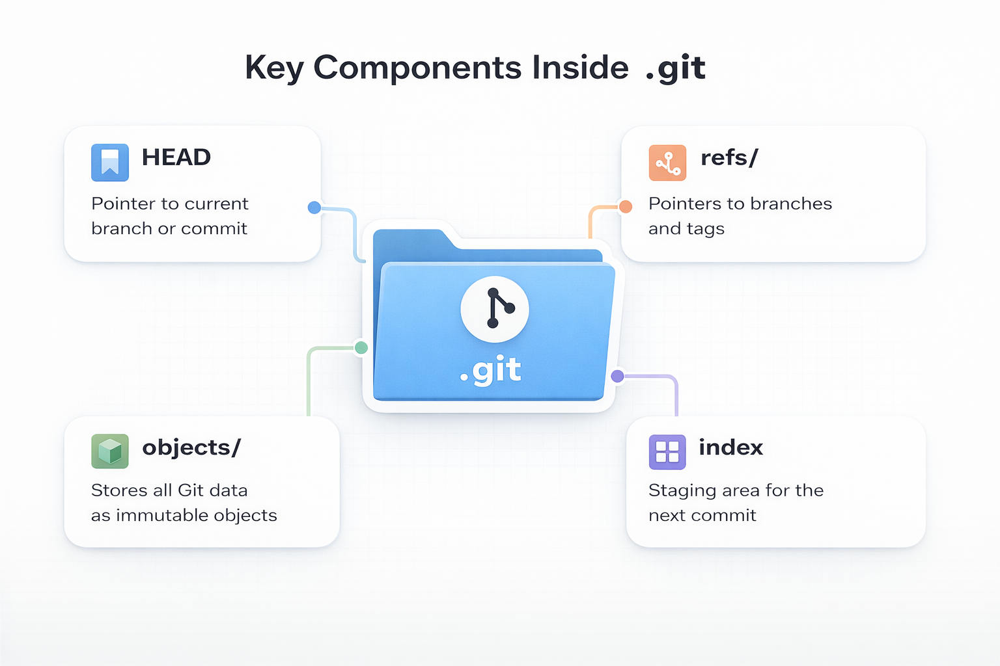
    

  </a>

 

### [Understanding Network Devices](https://blogwithsuraj.hashnode.dev/understanding-network-devices)

  <a href="https://blogwithsuraj.hashnode.dev/understanding-network-devices">
      

      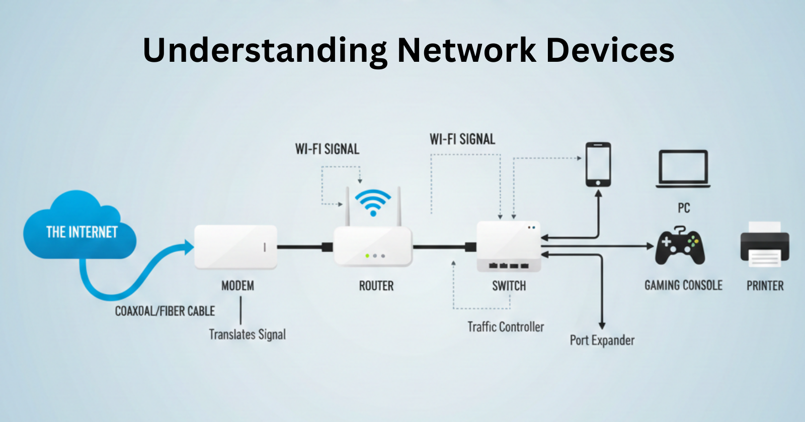
    

  </a>

 

### [How DNS Resolution Works](https://blogwithsuraj.hashnode.dev/howdnsresolutionworks)

  <a href="https://blogwithsuraj.hashnode.dev/howdnsresolutionworks">
      

      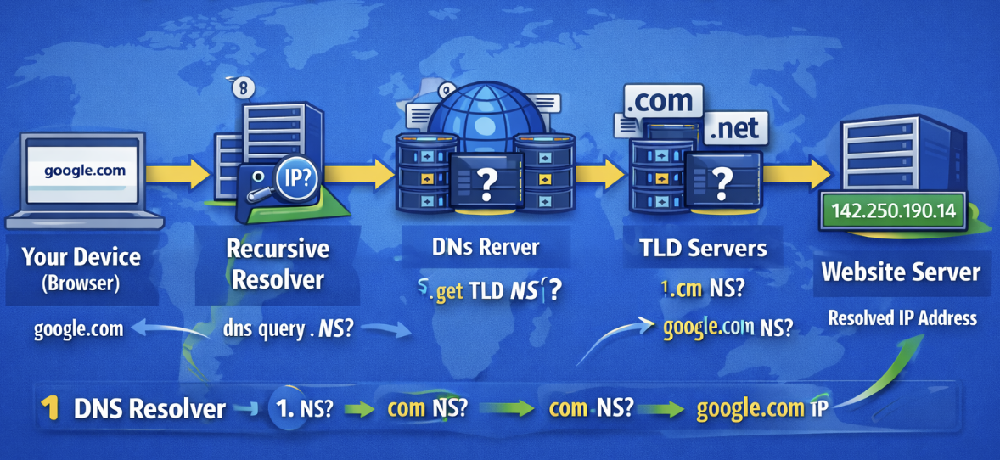
    

  </a>

 

### [DNS Record Types Explained](https://blogwithsuraj.hashnode.dev/dns-record-types)

  <a href="https://blogwithsuraj.hashnode.dev/dns-record-types">
      

      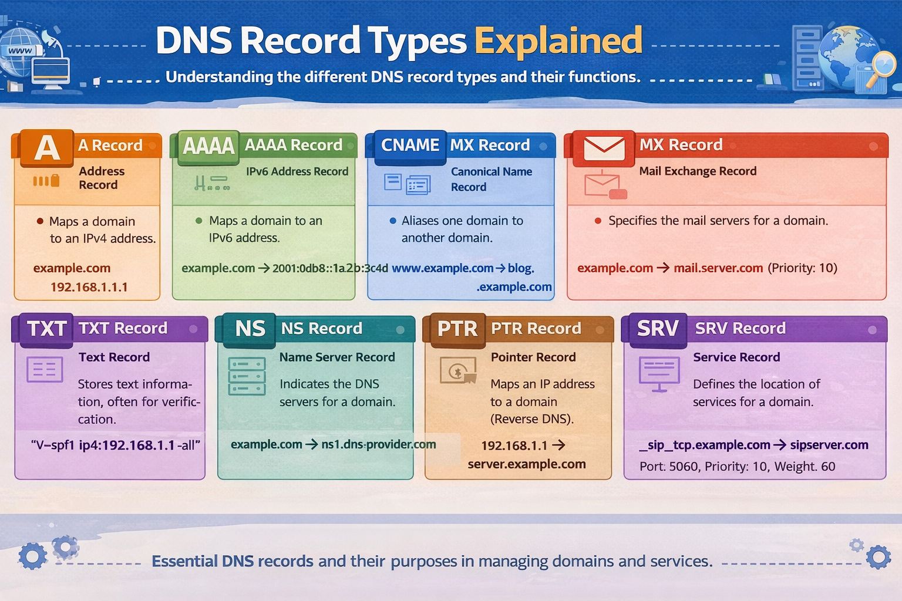
    

  </a>

 

### [Getting Started with cURL](https://blogwithsuraj.hashnode.dev/getting-started-with-curl)

  <a href="https://blogwithsuraj.hashnode.dev/getting-started-with-curl">
      

      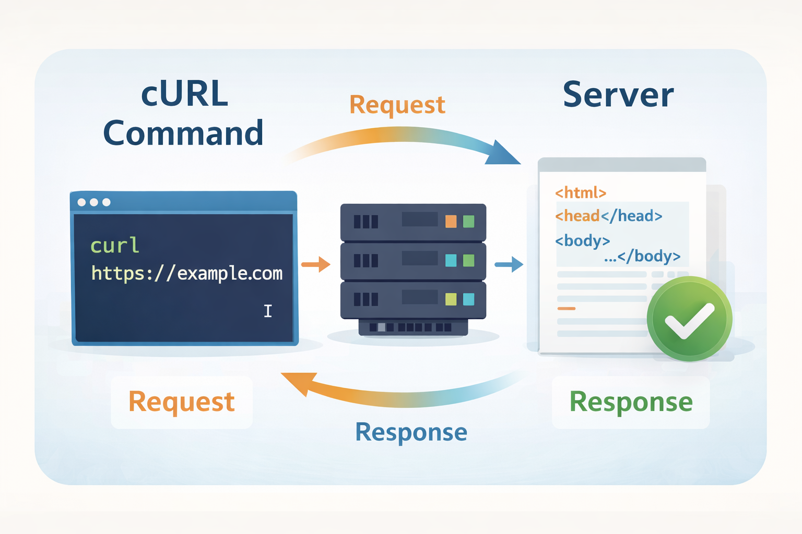
    

  </a>

 

### [TCP vs UDP (TCP Working: 3-Way Handshake)](https://blogwithsuraj.hashnode.dev/tcp-vs-udp)

  <a href="https://blogwithsuraj.hashnode.dev/tcp-vs-udp">
      

      
    

  </a>

 

### [How a Browser Works](https://blogwithsuraj.hashnode.dev/how-a-browser-works)

  <a href="https://blogwithsuraj.hashnode.dev/how-a-browser-works">
      

      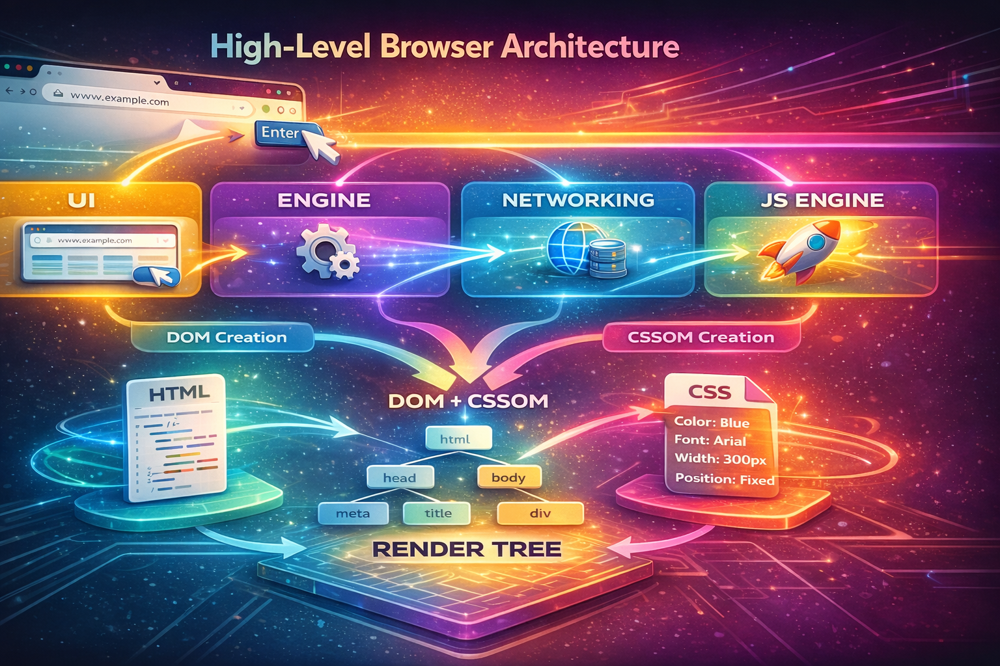
    

  </a>

 

### [Understanding HTML Tags and Elements](https://blogwithsuraj.hashnode.dev/understanding-html-tags-and-elements)

  <a href="https://blogwithsuraj.hashnode.dev/understanding-html-tags-and-elements">
      

      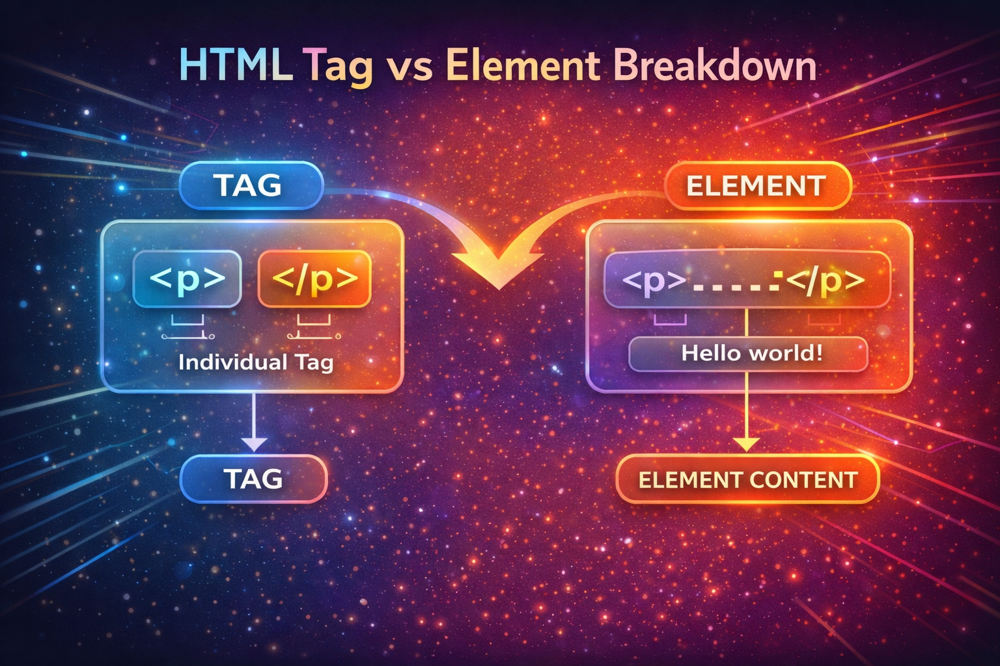
    

  </a>

 

### [Emmet for HTML](https://blogwithsuraj.hashnode.dev/emmet-for-html)

  <a href="https://blogwithsuraj.hashnode.dev/emmet-for-html">
      

      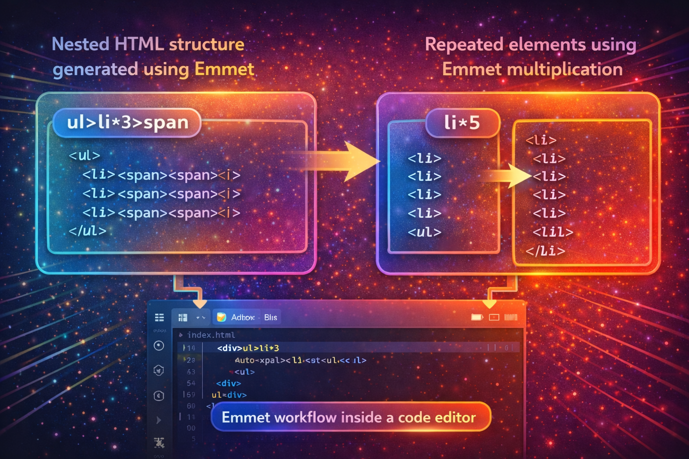
    

  </a>

 

### [CSS Selectors 101](https://blogwithsuraj.hashnode.dev/css-selectors)

  <a href="https://blogwithsuraj.hashnode.dev/css-selectors">
      

      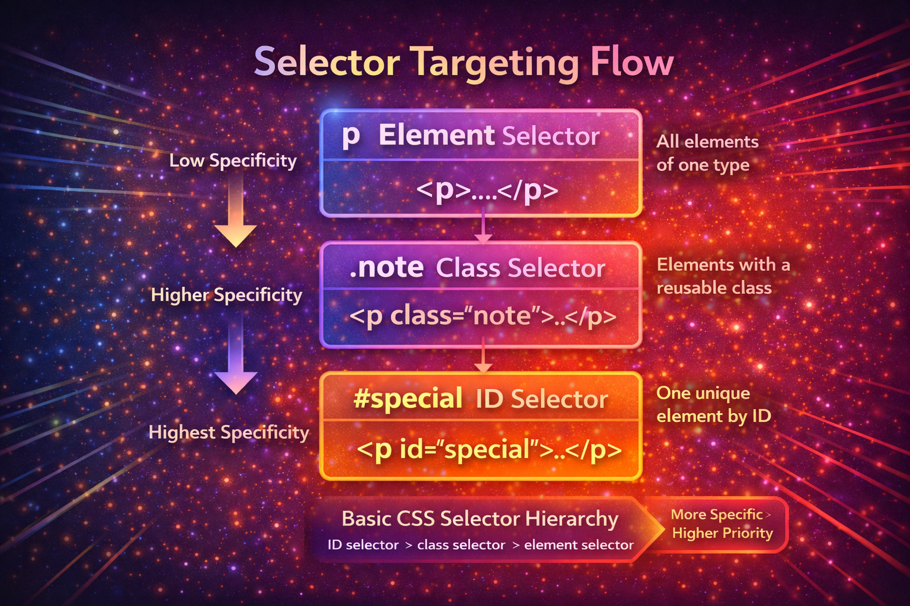
    

  </a>

 

## Contributing

Contributions are always welcome!

See [CONTRIBUTING.md](../CONTRIBUTING.md) for ways to get started.
  
